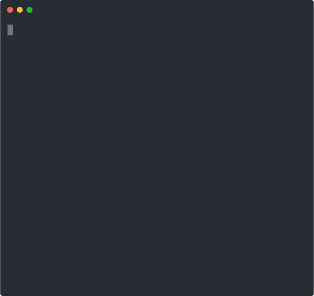

# EmbedMe

Simple utility to embed source files into markdown code blocks <sup>[why tho?](#why)</sup>

[](https://www.npmjs.com/package/embedme)
[](https://travis-ci.org/zakhenry/embedme)
[](https://commitizen.github.io/cz-cli/)



## Usage

With a `README.md` in your current working directory, add a code block for one of the
[supported file types](#multi-language) and start the code block simply with a comment with the path to a
file. For example

<!-- embedme-ignore-next -->

    This is a *markdown* document with a code block:

    ```ts
    // example.ts
    ```

Next, run the following

```bash
npx embedme README.md
```

Et voilà! Your README.md file will be updated with the content of your source file:

<!-- prettier-ignore -->
    This is a *markdown* document with a code block:

    ```ts
    // example.ts
    
    export function helloWorld(name: string): string {
      return `Hello ${name}!, how are you today?`;
    }
    
    ```

As the comment is preserved, you can happily re-run `embedme` and it will run again but there will be no changes.

## Features

<!-- embedme readme/help-output.txt -->

```txt
$ embedme --help
Usage: embedme [options] [...files]

Options:
  -V, --version              output the version number
  --verify                   Verify that running embedme would result in no changes. Useful for CI
  --dry-run                  Run embedme as usual, but don't write
  --source-root [directory]  Directory your source files live in in order to shorten the comment line in code fence
  --silent                   No console output
  --stdout                   Output resulting file to stdout (don't rewrite original)
  --strip-embed-comment      Remove the comments from the code fence. *Must* be run with --stdout flag
  -h, --help                 output usage information

```

### Partial Snippets

Very often you only want to highlight a small part of a file, to do so simply suffix the filename with the GitHub line
number syntax, e.g. `path/to/my/file.ts#L20-L30`.

### Multi Language

`embedme` simply uses the file type hint in a code fence to choose a strategy for finding the commented filename in the
first line of the code block. This is a relatively trivial regular expression, so many more languages can be supported
in future

Here's a list of file types supported by this utility, if you have a need for another language please feel free to
contribute, it is easy!

```ts
// src/embedme.lib.ts#L44-L73

enum SupportedFileType {
  PLAIN_TEXT = 'txt',
  TYPESCRIPT = 'ts',
  JAVASCRIPT = 'js',
  SCSS = 'scss',
  RUST = 'rust',
  JAVA = 'java',
  CPP = 'cpp',
  C = 'c',
  HTML = 'html',
  XML = 'xml',
  MARKDOWN = 'md',
  YAML = 'yaml',
  JSON = 'json',
  JSON_5 = 'json5',
  PYTHON = 'py',
  BASH = 'bash',
  SHELL = 'sh',
  GOLANG = 'go',
  OBJECTIVE_C = 'objectivec',
  PHP = 'php',
  C_SHARP = 'cs',
  SWIFT = 'swift',
  RUBY = 'rb',
  KOTLIN = 'kotlin',
  SCALA = 'scala',
  CRYSTAL = 'cr',
  PLANT_UML = 'puml',
  MERMAID = 'mermaid',
}
```

### Alternate embedding syntax

It is recommended to use the syntax described above as it is a good hint for readers and maintainers where the source of
this file is, however in some situations you may want to omit the comment in the code block, but still benefit from the
embedding behaviour of embedme.

This can be achieved by preceding the code block with a markdown comment in the form of `<!-- embedme path/to/your/file.txt -->`

For example:

<!-- embedme-ignore-next -->

    <!-- embedme example.ts -->
    This is a *markdown* document with a code block:

    ```ts
    ```

Will result in the following output

    <!-- embedme example.ts -->
    This is a *markdown* document with a code block:

    ```ts
    export function helloWorld(name: string): string {
      return `Hello ${name}!, how are you today?`;
    }

    ```

### Glob matching

If you want to run `embedme` over multiple files, you can use glob matching, i.e.

```bash
embedme src/**/*.md
```

Note that this globbing is shell expansion, not internally handled so _don't_ quote the glob expression. You can test
you output with `ls`, i.e. `ls src/**/*.md`

### CI Checks

If you're using continuous integration, you can pass the flag `--verify` to `embedme` to check that there are no changes
expected to your files. This is useful for repositories with multiple contributors who may not know about `embedme`, and
also for yourself as a sanity check that you remembered to run it after updating sample code!

### Output to stdout

Don't want to rewrite the file in-place? That's ok too - you can pass the flag `--stdout` to have the output pass to
stdout - this will allow you to redirect the output to another file.

Additionally, in this mode a `--strip-embed-comment` flag is available, which allows embedme to exclude the matched
comment from the output. This isn't generally recommended as the comment is generally unobtrusive, and will really help
maintainers to know where they should go to update the file.

Example

```sh
# readme/output-to-std-out.sh

embedme --stdout README.template.md > README.md

```

Note that with `--stdout` flag the log output from embedme is redirected to stderr so you can still see the logs but the
output can be redirected.

### Ignoring files

By default `embedme` uses the local `.gitignore` file to exclude any files that match your input but are ignored. You
can customise this ignore behavior by creating a `.embedmeignore` file, which uses the same syntax as `.gitignore`. This
file will be used _instead of_ `.gitignore`, not merged.

## Why?

> Why do I want this utility? Writing code in a markdown document is not difficult?

True, however it is difficult to know when your documentation files become out of date - if you're introducing a
breaking change, having your example code _actually using your library_ guarantees it will be correct.

> How can just having my examples in the language give me guarantees?

For starters if you're using a typesafe language (e.g. Typescript) you will get compiler errors, and secondarily you
really should be writing unit tests on your example code. As simple as it might be, how embarrassing is it if your
example doesn't even work?!
